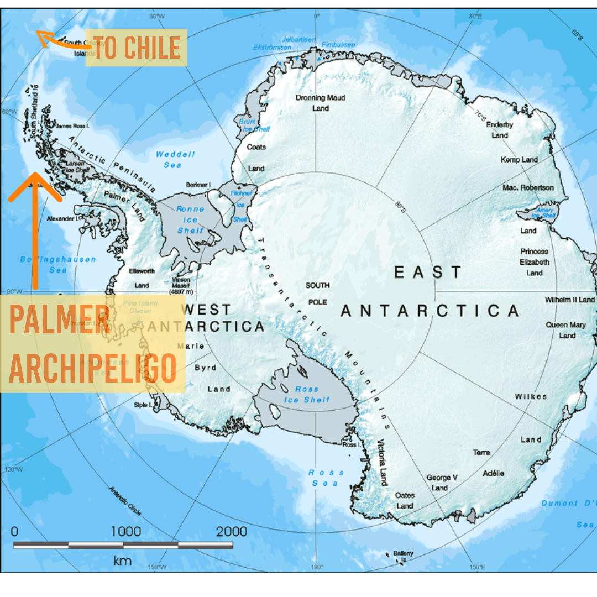

# Palmer Penguins Dashboard Comparison

A comparison between Tableau Public and Looker Studio dashboards using the **Palmer Archipelago Penguins dataset** from Antarctica. This project explores species distribution, body mass trends, and geographic patterns among **Gentoo, Chinstrap,** and **Adélie** penguins.

---

## Tools Used

- **Tableau Public**
- **Looker Studio**
- **Visual Studio Code**

---

## Dataset

**Source:** `penguins_lter.csv`  
A cleaned dataset representing species and island data from the Palmer Archipelago.

---

## Dashboards

- [📂 Tableau Dashboard Folder](PalmerPenguins_Comparison/Tableau)
- [📂 Looker Dashboard Folder](PalmerPenguins_Comparison/Looker)

---

## Live Dashboard
- [View Tableau Dashboard](https://public.tableau.com/app/profile/lauren.schwartzenburg/viz/PalmerPenguinsAntarctica/DashboardMain?publish=yes)

___

## Data Cleaning

The original dataset was lightly cleaned in both tools before dashboarding. Tasks included:

- Standardizing species names
- Creating calculated fields for visualization

---

# Overall Tool Findings

### Tableau Public

**Pros:**
- Intuitive drag-and-drop interface
- Advanced data modeling with calculated fields
- Allows branded graphics and visual customization
- Fast interactivity (dropdowns, filters, tooltips)
- Strong public community and daily inspiration

**Cons:**
- Can be glitchy, especially with layered visuals
- Requires frequent manual saves
- Some formatting quirks require workarounds

---

### Looker Studio

**Pros:**
- Clean UX and fast prototyping
- Automated refresh/scheduling with cloud integrations
- Lightweight and great for reports or clean comparisons
- Reliable through tasks 

**Cons:**
- Limited customization and branding options
- Less interactive flexibility than Tableau
- Some tools can have compatibility issues 

---

## 📄 License

MIT License — free to use with attribution.
